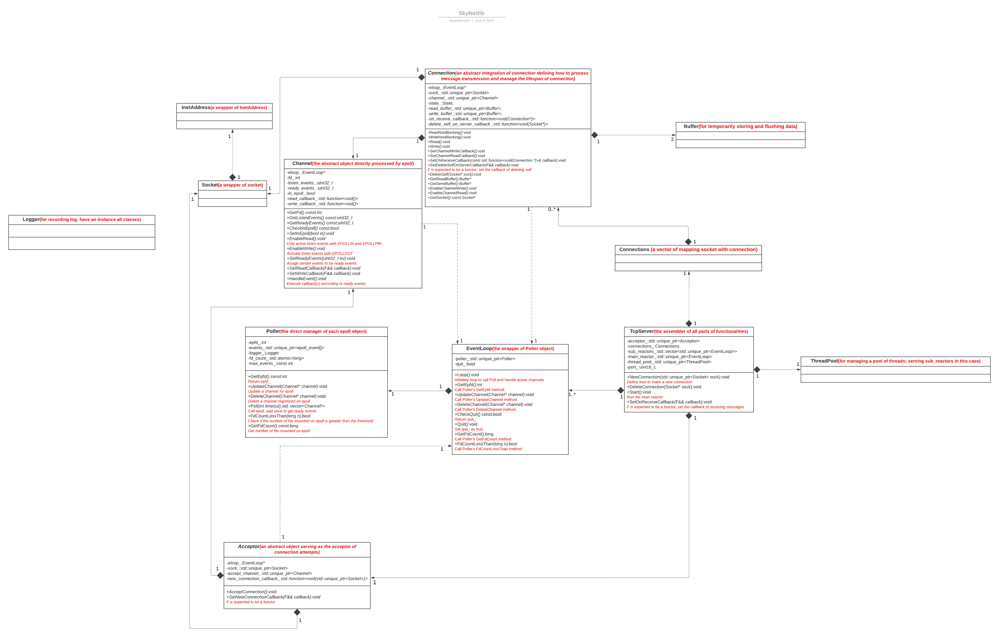

## SkyNetlib

### Overview

SkyNetlib is a network library written by C++. Although it is still in development, I already built up the framework of the library and demonstrated applications based on the library. 
SkyNetlib's core mechanism follows reactor pattern, which is achieved by deploying epolls monitoring file descriptors assigned proper callback function to handle events(read/write). To make better use of computer resources, I assign each epoll's execution to a separate thread. Below is the UML diagram.

&nbsp;

###  Structure

.src/&nbsp;&nbsp;&nbsp;&nbsp;&nbsp;&nbsp;&nbsp;&nbsp;&nbsp;&nbsp;&nbsp;&nbsp;&nbsp;&nbsp;&nbsp;&nbsp;&nbsp;&nbsp;&nbsp;&nbsp;&nbsp;&nbsp;&nbsp;&nbsp;&nbsp;&nbsp;&nbsp;&nbsp;&nbsp;&nbsp;&nbsp;&nbsp;&nbsp;&nbsp;&nbsp;<==  source code of library

.include/&nbsp;&nbsp;&nbsp;&nbsp;&nbsp;&nbsp;&nbsp;&nbsp;&nbsp;&nbsp;&nbsp;&nbsp;&nbsp;&nbsp;&nbsp;&nbsp;&nbsp;&nbsp;&nbsp;&nbsp;&nbsp;&nbsp;&nbsp;&nbsp;&nbsp;&nbsp;&nbsp;<==  header files

.application/&nbsp;&nbsp;&nbsp;&nbsp;&nbsp;&nbsp;&nbsp;&nbsp;&nbsp;&nbsp;&nbsp;&nbsp;&nbsp;&nbsp;&nbsp;&nbsp;&nbsp;&nbsp;&nbsp;&nbsp;&nbsp;<==  test files that could be executed to verify the functionality

.static_files/&nbsp;&nbsp;&nbsp;&nbsp;&nbsp;&nbsp;&nbsp;&nbsp;&nbsp;&nbsp;&nbsp;&nbsp;&nbsp;&nbsp;&nbsp;&nbsp;&nbsp;&nbsp;&nbsp;&nbsp;&nbsp;<==  store static files, an important part is my elaboration of algorithms & data structures      

&nbsp;

### Tested on

Ubuntu 20.04.5

&nbsp;

### Prerequisites

Clang >= 6.0  or  GCC >= 5.0

CMake >= 3.8 

&nbsp;

### Build

`git clone https://github.com/skystriker1997/skynetlib.git /your/directory`

`cd /your/directory; mkdir build; cd build`

`cmake /your/directory`

`cmake --build .`

&nbsp;

### Inspiration

The design of event-driven mode is inspired by **[muduo](https://github.com/chenshuo/muduo)** developed by Shuo Chen.

